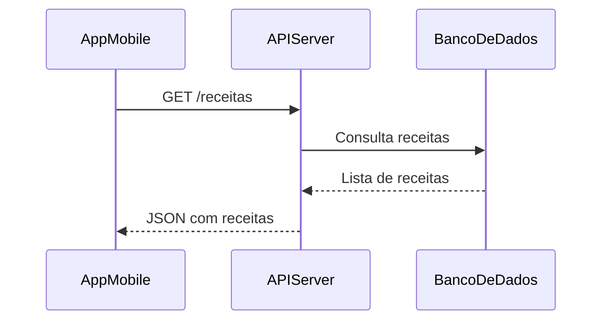
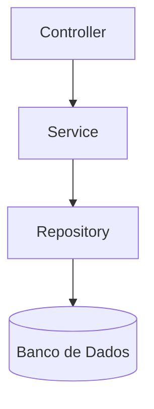

# Introdução APIs REST

Imagine um **restaurante digital**, onde você (cliente) quer pedir uma pizza usando seu celular, notebook ou até mesmo uma TV smart.

Neste restaurante:

- O **cardápio** é a **documentação da API**.
- O **cozinheiro** é o **servidor**.
- O **pedido que você faz** é uma **requisição HTTP (GET, POST, PUT, DELETE)**.
- A **entrega do pedido** é a **resposta do servidor (JSON)**.

---

## O que é uma API?

**API** (Application Programming Interface) é um **cardápio digital** que permite que **aplicações conversem entre si** de maneira padronizada. Com ela, você consegue conectar:

- Aplicativos mobile (Android, iOS)
- Sistemas web (frontend em React, Angular...)
- Aplicações desktop
- Dispositivos IoT... e muito mais!

> A API é o **garçom** que leva seu pedido à cozinha (servidor) e traz a resposta de volta.

---

## Por que REST?

REST (REpresentational State Transfer) é um **estilo arquitetural** para construir APIs simples e organizadas, usando o **protocolo HTTP**.

### Princípios REST:

| Princípio       | Significado Simples                                      |
|------------------|----------------------------------------------------------|
| Stateless        | Cada requisição é independente (sem memória do passado)  |
| Client-Server    | O cliente e o servidor são separados                     |
| Cacheable        | Respostas podem ser armazenadas para acelerar            |
| Uniform Interface| Regras padronizadas para comunicação                     |
| Layered System   | A API pode ter camadas intermediárias (segurança, cache...)|

---

## Como funciona uma API REST?

Vamos usar um exemplo: um aplicativo de receitas que acessa dados de um servidor.

### Exemplo de Requisição

GET /receitas HTTP/1.1
Host: api.meurestaurante.com
Accept: application/json

### Exemplo de Resposta

```json
[
  { "id": 1, "nome": "Pizza Margherita", "tempo": "30min" },
  { "id": 2, "nome": "Lasanha", "tempo": "45min" }
]
````


### Métodos HTTP (as ações do garçom)

Verbo | Ação | Exemplo REST
-- | -- | --
GET | Obter dados | GET /receitas
POST | Criar algo novo | POST /receitas
PUT | Atualizar algo | PUT /receitas/1
DELETE | Remover algo |DELETE /receitas/1



### Componentes de uma API REST com Spring Boot

> Lembre-se que a API é uma aplicação sem telas, então não temos a camada `VIEW`.



#### Componentes

* **Controller**: recebe a requisição (entrada)
* **Service**: lógica de negócio
* **Repository**: acesso ao banco
* **Banco de Dados**: onde os dados vivem
